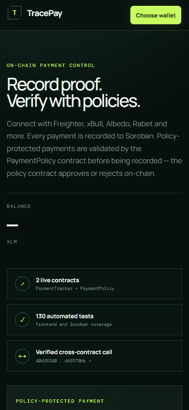
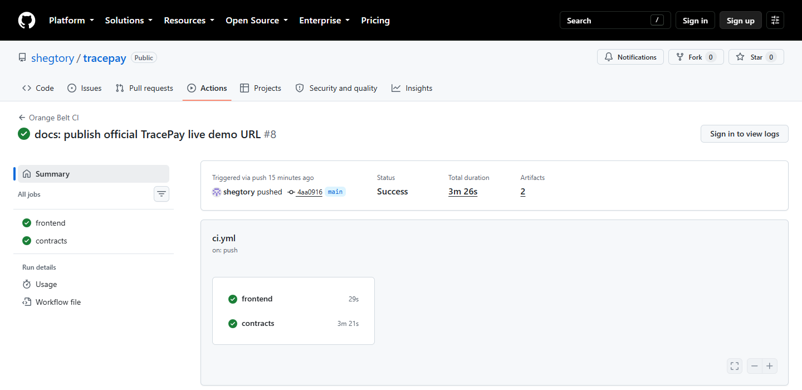
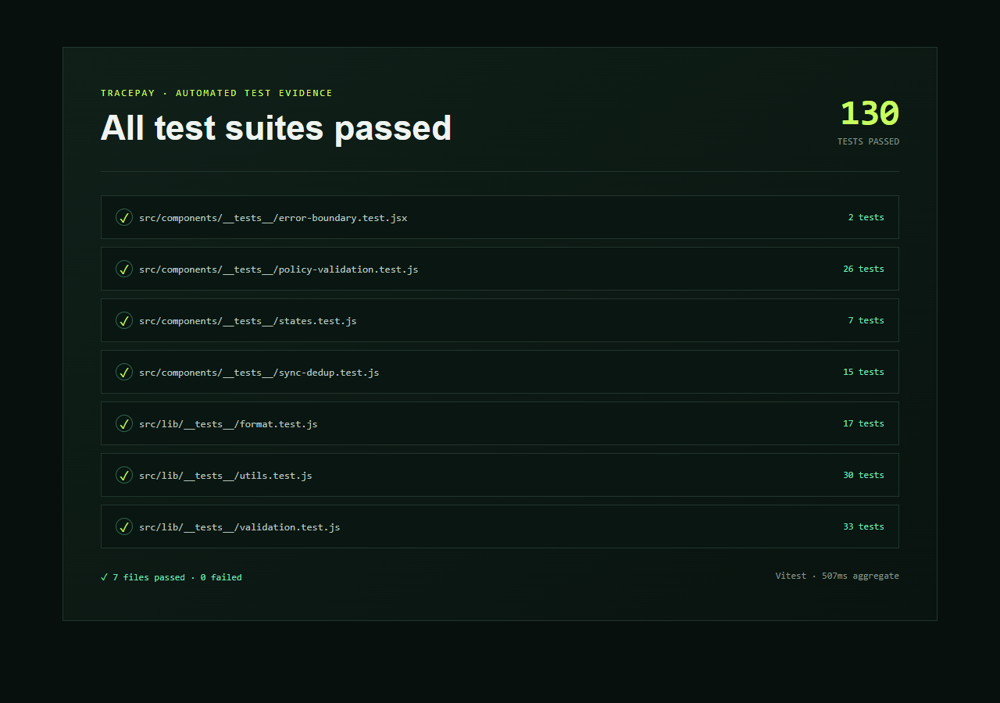
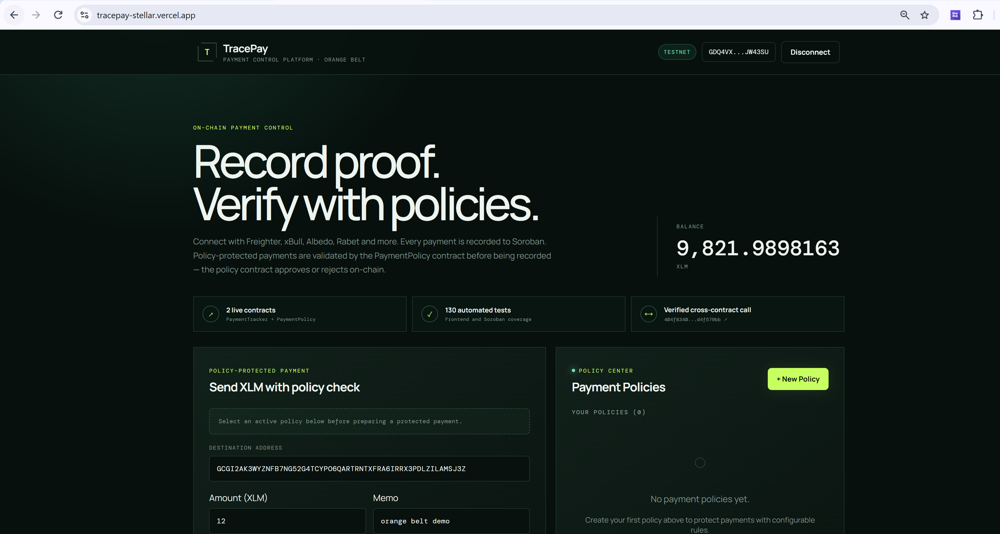
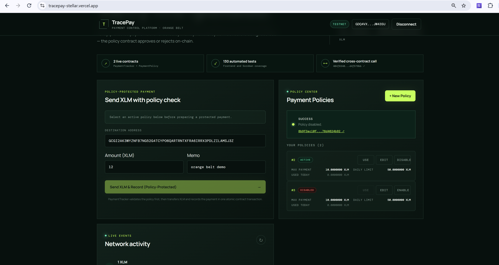
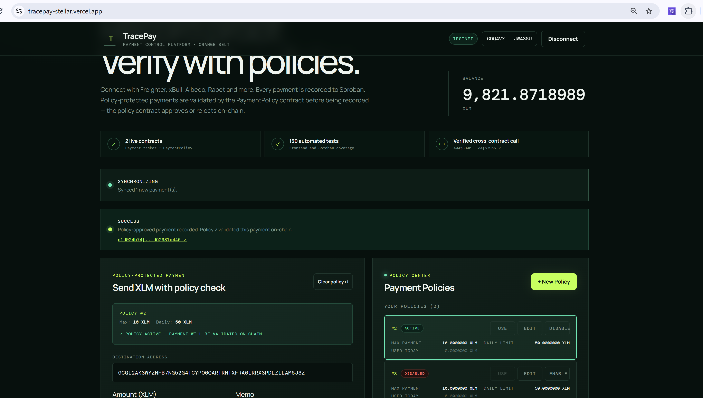
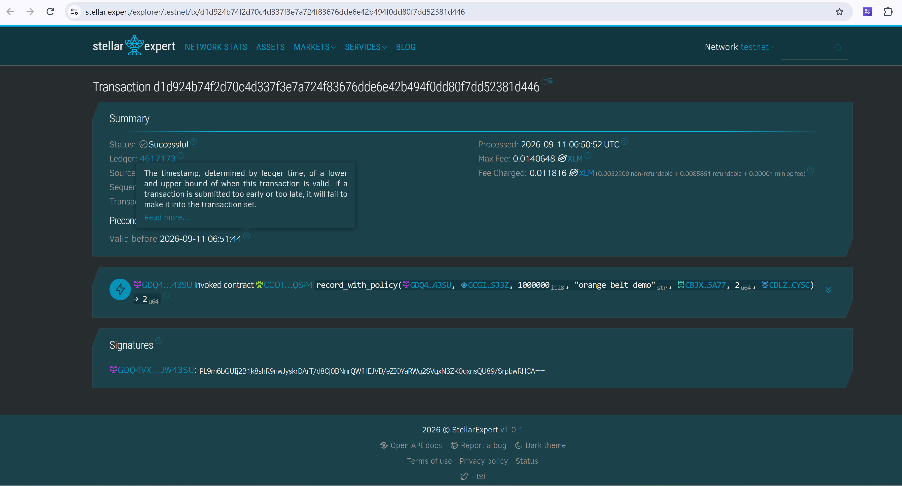
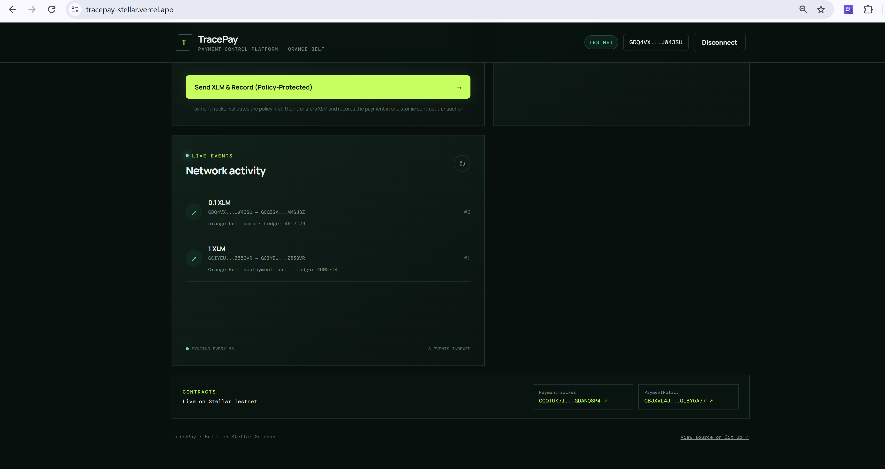
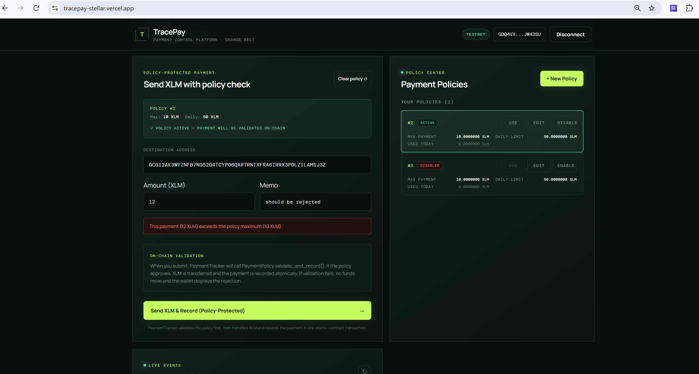

# TracePay — Orange Belt Payment Control Platform

[](https://github.com/shegtory/tracepay/actions/workflows/ci.yml)
[](https://stellar.org/)

TracePay is a multi-wallet Stellar Testnet dApp that transforms payment tracking into a
production-oriented payment-control and verification platform. It uses two Soroban smart
contracts — **PaymentTracker** and **PaymentPolicy** — that communicate with each other
through real inter-contract invocations, enforcing configurable payment policies before
recording any on-chain payment.

**Live Demo:** [tracepay-stellar.vercel.app](https://tracepay-stellar.vercel.app/)

## Evolution

| Belt | Focus | Highlights |
| --- | --- | --- |
| Level 1 (White) | Wallet + balance + single payment | Freighter/xBull/Albedo/Rabet, XLM transfer, contract record, balance display |
| Level 2 (Yellow) | Event-backed activity | Live contract-event sync, loading/error/empty/ready states, manual resync |
| Level 3 (Orange) | Payment control & verification | **PaymentPolicy** contract, inter-contract calls, policy-protected payments, Policy Center, comprehensive error model, CI/CD, deployment workflow, mobile-responsive, contract + frontend tests |

## Deployed Contracts (Stellar Testnet)

| Contract | Contract ID | Explorer |
| --- | --- | --- |
| PaymentTracker | `CCOTUK7IGNSQVZNZKBL4GWAN44MMT7AXBSDBBDJZY5LFOX4TGDANQSP4` | [View on Stellar Expert](https://stellar.expert/explorer/testnet/contract/CCOTUK7IGNSQVZNZKBL4GWAN44MMT7AXBSDBBDJZY5LFOX4TGDANQSP4) |
| PaymentPolicy | `CBJXVL4JBLF63BJARMWLD3YEXKOCPV4PUHJ6EOE2TJPMJ3L2QIBY5A77` | [View on Stellar Expert](https://stellar.expert/explorer/testnet/contract/CBJXVL4JBLF63BJARMWLD3YEXKOCPV4PUHJ6EOE2TJPMJ3L2QIBY5A77) |

**Verified live-demo transaction:** [`d1d924b74f2d70c4d337f3e7a724f83676dde6e42b494f0dd80f7dd52381d446`](https://stellar.expert/explorer/testnet/tx/d1d924b74f2d70c4d337f3e7a724f83676dde6e42b494f0dd80f7dd52381d446)

**Deployment verification transaction:** [`404f8340ba30d88e8b9a68fa3e1bac5566fa37e1d272293190d1db46d4f579bb`](https://stellar.expert/explorer/testnet/tx/404f8340ba30d88e8b9a68fa3e1bac5566fa37e1d272293190d1db46d4f579bb)

**Successful deployment workflow:** [GitHub Actions run #34474672283](https://github.com/shegtory/tracepay/actions/runs/34474672283)

## Level 3 Feature List

- **Two-contract architecture** — PaymentTracker (records payments) + PaymentPolicy (validates payments against rules)
- **Real inter-contract communication** — PaymentTracker invokes PaymentPolicy before recording a protected payment
- **PaymentPolicy contract** — create policies, set max amount, optional daily limit, optional approved recipient, enable/disable, owner-only authorization, policy usage tracking, rich event stream
- **Policy Center UI** — create policies, list owned policies, select a policy, configure limits and recipient, enable/disable
- **Policy-protected payment flow** — select a policy, submit a payment, see the policy validation result, see which contract approved/rejected
- **Full transaction state machine** — idle, preparing, simulating, awaiting wallet approval, submitting, confirming, synchronizing, success, failure
- **Duplicate-submission guard** — no action can be submitted while any transaction is active
- **Comprehensive error model** — wallet unavailable/locked, access/signature rejected, wrong network, invalid address/amount, insufficient balance, unauthorized policy operation, policy disabled, payment exceeds limit, recipient not approved, contract simulation/invocation failure, RPC unavailable, event synchronization failure, deployment configuration missing
- **Real-time synchronization** — initial + incremental sync for both contracts, loading/empty/ready/error states, last synchronized ledger, manual retry/resync, deduplication by event identity, safe polling cleanup, no duplicate React initialization loops
- **Mobile-responsive** — works at ~375px mobile, tablet, and desktop; no horizontal overflow; touch targets; long Stellar addresses handled
- **CI pipeline** — npm ci, lint, typecheck, tests, production build for frontend; rustfmt check, contract tests, contract build for contracts; runs on PRs and pushes to main
- **Deployment workflow** — manually triggered (workflow_dispatch), builds both contracts, creates a funded ephemeral Testnet deployer, deploys both contracts, creates a verification policy, executes an atomic inter-contract payment, records contract IDs and transaction hashes, and preserves WASM artifacts
- **Contract tests** — PaymentPolicy: create, update, enable/disable, authorization, validation (approved, exceeds limit, unauthorized recipient, disabled policy, daily limit), events. PaymentTracker: record, policy reference, multiple policies, recent ordering, limit, backward compatibility
- **Frontend tests** — policy form validation, mobile navigation, transaction state rendering, policy approval/rejection display, activity sync + deduplication, wallet/network errors, duplicate-submission prevention
- **Production-oriented architecture** — feature-based layering (wallet, payments, policies, activity), contract service layer, event service, config, types, utils, test setup
- **Complete documentation** — product overview, evolution, architecture diagram, inter-contract explanation, contract method/event tables, authorization model, error model, sync design, setup, env vars, commands, CI, deployment, secrets, explorer links, screenshots, demo script, security, known limitations, submission checklist

## Architecture

```
┌─────────────────────────────────────────────────────────┐
│                      Frontend (React + Vite)            │
├─────────────────────────────────────────────────────────┤
│  Wallet layer   Payment flow   Policy Center   Activity  │
│  (Stellar Wallets Kit)  (XLM + contract call) (create,   │
│                          select, configure)    list, sync) │
├────────────────────────────────┬────────────────────────┤
│  Contract service              │  Event service          │
│  - read contracts             │  - poll contract events │
│  - invoke record              │  - poll policy events   │
│  - invoke record_with_policy  │  - deduplicate          │
│  - invoke policy CRUD         │  - manual resync        │
├────────────────────────────────┴────────────────────────┤
│              Soroban Smart Contracts (Testnet)           │
│                                                         │
│  ┌──────────────────┐    inter-contract call    ┌───────┴──────┐
│  │ PaymentTracker   │ ───────────────────────►  │ PaymentPolicy │
│  │                  │    record_with_policy()    │              │
│  │ record()         │                           │ create()      │
│  │ record_with_    │ ◄──────── approval ─────── │ update()      │
│  │   policy()       │                           │ set_enabled() │
│  │ count()          │                           │ validate()    │
│  │ get()            │                           │ recent_usage()│
│  │ recent()         │                           └───────────────┘
│  │ payments_by_     │
│  │   policy()       │
│  └──────────────────┘
└─────────────────────────────────────────────────────────┘
```

## Inter-Contract Communication

When a user submits a policy-protected payment, the frontend builds a Soroban transaction
that invokes `PaymentTracker.record_with_policy(...)`. Inside that contract method, if a
policy contract address and policy id are provided, the PaymentTracker contract makes a
**real cross-contract invocation** to `PaymentPolicy.validate_and_record(...)` on the
policy contract. PaymentPolicy checks the policy rules (max amount, daily limit, approved
recipient, enabled status) and returns whether the payment is approved. If approved,
PaymentTracker records the payment and emits a `payment` event enriched with the policy
reference. If rejected, the contract returns a deterministic error and the atomic transaction
rolls back, so no funds, state changes, or misleading success events are committed.

This is **not simulated** in the frontend. The inter-contract call happens on-chain
between two deployed contracts. The contract tests prove the behavior.

## PaymentTracker Contract

Source: `contracts/payment-tracker/`

### Methods

| Method | Parameters | Returns | Description |
| --- | --- | --- | --- |
| `record` | sender, destination, amount, memo | u64 (payment id) | Records a payment without policy validation (backward-compatible) |
| `record_with_policy` | sender, destination, amount, memo, policy_contract, policy_id, token_contract | u64 (payment id) | Validates policy, transfers XLM, and records the payment atomically through nested contract calls |
| `count` | — | u64 | Total number of payments recorded |
| `get` | id | Option<PaymentRecord> | A single payment record by id |
| `recent` | limit | Vec<PaymentRecord> | Most recent payments (capped at 20) |
| `payments_by_policy` | policy_id | Vec<PaymentRecord> | All payments that used a specific policy |

### PaymentRecord fields

| Field | Type | Description |
| --- | --- | --- |
| id | u64 | Monotonically increasing payment id |
| sender | Address | Stellar address of the sender |
| destination | Address | Stellar address of the recipient |
| amount | i128 | Amount in stroops (1 XLM = 10,000,000 stroops) |
| memo | String | Optional memo (max 64 chars) |
| ledger | u32 | Ledger sequence when recorded |
| policy_id | Option<u64> | Policy id if policy-protected, else None |
| policy_approved | bool | Whether the policy approved the payment |
| policy_contract | Option<Address> | Policy contract address if policy-protected |

### Events

| Event | Topics | Data | Description |
| --- | --- | --- | --- |
| `PaymentRecorded` | `["payment"]` | sender, id, destination, amount, memo, policy_id, policy_approved | Emitted when a payment is recorded |
| `PaymentRejected` | `["payment"]` | sender, id, destination, amount, reason, policy_id | Emitted when a policy-protected payment is rejected |

## PaymentPolicy Contract

Source: `contracts/payment-policy/`

### Methods

| Method | Parameters | Returns | Description |
| --- | --- | --- | --- |
| `create` | max_amount, daily_limit, approved_recipient | u64 (policy id) | Creates a new policy; caller becomes owner |
| `get_policy` | id | Option<Policy> | A single policy by id |
| `get_owner` | id | Option<Address> | Owner of a policy |
| `get_policies_by_owner` | owner | Vec<Policy> | All policies owned by an address |
| `update` | id, max_amount, daily_limit, approved_recipient | — | Updates policy configuration (owner only) |
| `set_enabled` | id, enabled | — | Enables or disables a policy (owner only) |
| `validate_and_record` | policy_id, sender, destination, amount, caller | bool | Validates a destination and amount against an owner-controlled policy; records usage; emits approval/rejection event |
| `policy_count` | — | u64 | Total number of policies |
| `usage_count` | — | u64 | Total number of policy usage records |
| `recent_usage` | limit | Vec<PolicyUsage> | Most recent policy usage records |

### Policy fields

| Field | Type | Description |
| --- | --- | --- |
| id | u64 | Monotonically increasing policy id |
| owner | Address | Policy owner (only this address can update/enable/disable) |
| max_amount | i128 | Maximum allowed single payment (stroops) |
| daily_limit | Option<i128> | Optional daily spending limit (stroops); None = no daily limit |
| approved_recipient | Option<Address> | Optional approved destination; None = any destination allowed |
| enabled | bool | Whether the policy is active |
| total_used_today | i128 | Running total of approved payments today |
| daily_reset_ledger | u32 | Ledger at which the daily counter last reset |

### PolicyUsage fields

| Field | Type | Description |
| --- | --- | --- |
| policy_id | u64 | Policy this usage refers to |
| sender | Address | Sender of the payment |
| amount | i128 | Payment amount in stroops |
| approved | bool | Whether the policy approved the payment |
| reason | String | Approval reason or rejection reason |
| ledger | u32 | Ledger sequence |

### Events

| Event | Topics | Data | Description |
| --- | --- | --- | --- |
| `PolicyCreated` | `["policy"]` | id, owner, max_amount | Emitted when a policy is created |
| `PolicyUpdated` | `["policy"]` | id, max_amount, daily_limit, approved_recipient | Emitted when a policy is updated |
| `PolicyEnabled` | `["policy"]` | id, enabled | Emitted when a policy is enabled/disabled |
| `PolicyApproved` | `["policy"]` | id, sender, amount, ledger | Emitted when a payment is approved by a policy |
| `PolicyRejected` | `["policy"]` | id, sender, amount, reason, ledger | Emitted when a payment is rejected by a policy |

## Authorization Model

- **PaymentTracker**: Requires `sender.require_auth()` on every `record` and `record_with_policy` call. The sender is the Stellar account that signs the transaction.
- **PaymentPolicy**:
  - `create`: The caller (invoker contract address) becomes the policy owner.
  - `update`, `set_enabled`: Only the policy owner can call these. Calls from other addresses panic with `unauthorized`.
  - `validate_and_record`: Only the policy owner (or an authorized contract) can invoke validation. In the inter-contract flow, PaymentTracker calls this as the policy owner context.
- **Inter-contract**: PaymentTracker invokes PaymentPolicy. The authorization pass-through is enforced at the contract level — a payment cannot bypass the policy by calling PaymentTracker directly with a policy reference, because PaymentTracker itself invokes the policy.

## Error Model

| Error class | Trigger | User-facing message |
| --- | --- | --- |
| Wallet unavailable | No wallet installed or selected | "Selected wallet was not found or is unavailable." |
| Wallet locked | Wallet requires unlock before signing | "Wallet is locked. Please unlock it and try again." |
| Access rejected | User denied the connection | "Wallet connection was rejected." |
| Signature rejected | User denied a transaction | "Transaction was rejected in your wallet." |
| Wrong network | Wallet on non-Testnet network | "Wrong network: switch the selected wallet to Stellar Testnet." |
| Invalid address | Destination does not match Stellar address pattern | "Enter a valid Stellar public key (starts with G, 56 characters)." |
| Invalid amount | Amount empty, NaN, or <= 0 | "Enter an amount greater than 0." |
| Insufficient balance | Balance < amount | "Insufficient XLM balance for this transaction." |
| Unauthorized policy operation | Non-owner tries to update/disable a policy | "Only the policy owner can update or disable this policy." |
| Policy disabled | Payment sent to a disabled policy | "This policy is disabled and cannot approve payments." |
| Payment exceeds limit | Amount > policy max_amount | "Payment amount exceeds the policy maximum." |
| Recipient not approved | Destination is not the approved recipient | "Destination is not the approved recipient for this policy." |
| Contract simulation failure | RPC simulation returned error | "The contract rejected the transaction. Check the inputs and try again." |
| Contract invocation failure | On-chain invocation failed | "The contract call failed on-chain. Check the transaction on Stellar Expert." |
| RPC unavailable | Horizon or Soroban RPC unreachable | "Stellar network is unavailable. Check your connection and try again." |
| Event synchronization failure | Event poll failed | "Could not synchronize activity. Press resync to retry." |
| Deployment configuration missing | Contract IDs are absent from environment and deployment.json | "Deployment pending. Set the contract IDs after deploying." |

No raw stack traces, XDR, or secrets are exposed to users.

## Event Synchronization Design

The frontend synchronizes events from both contracts using the Soroban RPC `getEvents` endpoint.

**Mechanism**: RPC event polling via `rpcServer.getEvents(...)`. We poll the `payment` topic
on PaymentTracker and the `policy` topic on PaymentPolicy.

**Initial synchronization**: On first load, fetch up to 2000 ledgers of recent events from
each contract and seed the baseline.

**Incremental synchronization**: After the baseline is set, poll for new events since the
last synchronized ledger. Only new (not previously seen) events are appended.

**Deduplication**: Each event has a unique identity (event id + tx hash). The frontend
maintains a Set of seen event ids and skips duplicates.

**Polling cleanup**: The interval is cleared on unmount. No duplicate React initialization
loops — the sync interval is created once per component lifecycle.

**States**:
- `loading` — first sync in flight
- `ready` — synced, showing records
- `error` — last sync failed, manual retry available
- `empty` — synced but no records in the current filter

**Last synchronized**: The frontend tracks the last synchronized ledger sequence and displays
it in the activity footer.

**Manual retry**: A resync button re-fetches from the current ledger.

**Policy and payment events**: Both are fetched and displayed in their respective panels.

## Local Setup

```bash
cd G:/stellar-hackathon/orange-belt/shegtory/repo
npm install
cp .env.example .env.local
# Edit .env.local with the deployed contract IDs after deployment
npm run dev
```

### Environment Variables

| Variable | Required | Description |
| --- | --- | --- |
| `VITE_PAYMENT_TRACKER_CONTRACT_ID` | Yes (after deployment) | Stellar Testnet contract id of PaymentTracker |
| `VITE_PAYMENT_POLICY_CONTRACT_ID` | Yes (after deployment) | Stellar Testnet contract id of PaymentPolicy |

### Frontend Commands

| Command | Description |
| --- | --- |
| `npm run dev` | Start Vite dev server |
| `npm run build` | Production build to dist/ |
| `npm run preview` | Preview production build |
| `npm run lint` | Run oxlint on src/ |
| `npm run typecheck` | Run TypeScript type check |
| `npm run test` | Run Vitest tests (non-watch) |
| `npm run test:watch` | Run Vitest in watch mode |

### Contract Commands

From the repository root:

```bash
# Install the wasm target
rustup target add wasm32v1-none

# Format check (both contracts)
cargo fmt --check --manifest-path contracts/payment-tracker/Cargo.toml
cargo fmt --check --manifest-path contracts/payment-policy/Cargo.toml

# Run contract tests (both contracts)
cargo test --manifest-path contracts/payment-tracker/Cargo.toml
cargo test --manifest-path contracts/payment-policy/Cargo.toml

# Build WASM (both contracts)
stellar contract build --manifest-path contracts/payment-tracker/Cargo.toml
stellar contract build --manifest-path contracts/payment-policy/Cargo.toml
```

### CI

The CI workflow `.github/workflows/ci.yml` runs on pull requests and pushes to `main`.
It runs the full frontend pipeline (npm ci, lint, typecheck, test, build) and the contract
pipeline (rustfmt check, contract tests, contract build). It does **not** deploy.

### Deployment Workflow

The deployment workflow `.github/workflows/deploy-testnet.yml` is **manually triggered**
(workflow_dispatch). It is Testnet-only and deploys both contracts, configures the
inter-contract dependency, and outputs real contract IDs and the transaction hash.

The workflow uses a freshly generated and Friendbot-funded Testnet identity, so no deployment secret is required.

## Security Considerations

- **Testnet only**: All contracts and transactions target Stellar Testnet. Never use real
  secret keys or mainnet credentials.
- **No private keys in frontend**: The frontend never contains or transmits secret keys.
  Signing is always delegated to the connected wallet.
- **No seed phrases**: The repository never contains seed phrases or mnemonic phrases.
- **Contract authorization**: PaymentPolicy enforces owner-only modification. PaymentTracker
  enforces sender authentication. Inter-contract calls respect these boundaries.
- **Policy bypass resistance**: A payment cannot bypass a policy by omitting the policy
  reference when a policy is configured for the payment — the contract enforces the check.
- **Input validation**: All contract inputs are validated (amount > 0, memo length, address
  format). Invalid inputs panic with clear messages before any state change.
- **Event privacy**: Events contain only on-chain data (addresses, amounts, ids). No
  private data is emitted.
- **Secrets management**: The Testnet workflow generates a short-lived funded identity and
  never stores a production secret in the repository.
- **Trust boundaries**:
  - The frontend trusts the connected wallet to sign correctly.
  - The contracts trust the Soroban RPC and the Stellar network.
  - The deployment workflow trusts GitHub Actions and the Stellar Testnet network.
  - Users trust the deployed contract code (verify via the explorer).

## Known Limitations

- **Testnet only**: This is a Testnet demonstration. Mainnet deployment requires additional
  security review, audit, and key management.
- **Single owner per policy**: Each policy has one owner. Multi-sig or role-based access is
  not implemented at this level.
- **Daily reset is ledger-based**: The daily limit resets at the next ledger after the
  policy's daily_reset_ledger, not at a calendar boundary.
- **No policy deletion**: Policies cannot be deleted, only disabled. This preserves the audit
  trail.
- **Event polling latency**: Real-time synchronization depends on polling intervals. For
  production, consider webhooks, indexed event services, or Stellar event streaming.
- **Contract size**: Both contracts are small but might need optimization for mainnet
  resource limits.
- **No upgrade mechanism**: Contracts are immutable after deployment. Migration requires
  deploying new contracts and reconfiguring.
- **Frontend tests use mocks**: Automated tests mock the Stellar SDK and wallet kit. They do
  not prove on-chain behavior — that is covered by contract tests and deployment verification.

## Screenshots

| Mobile responsive UI | CI pipeline | 130 passing tests |
| --- | --- | --- |
|  |  |  |

| Wallet connected | Policy created | Policy-protected payment |
| --- | --- | --- |
|  |  |  |

| Stellar Expert proof | Real-time event feed | Policy rejection |
| --- | --- | --- |
|  |  |  |

All evidence is stored in `docs/screenshots/orange-belt/` with reproducible capture scripts.

## Demo Video

Watch the [TracePay Orange Belt demo video](https://drive.google.com/file/d/1E1itD-Pr3mE149ZFxKFXVENCD5wHqf0l/view?usp=sharing).
The reproducible presentation flow is documented in `docs/demo-script.md`.

## Submission Checklist

- [x] Public GitHub repository with complete Git history
- [x] Root README with product overview, evolution, features, architecture, contracts,
  authorization, error model, sync design, setup, env vars, commands, CI, deployment,
  secrets, explorer links, screenshots, demo script, security, known limitations,
  submission checklist
- [x] PaymentTracker contract source and tests
- [x] PaymentPolicy contract source and tests
- [x] Inter-contract communication implemented and tested
- [x] Frontend with wallet connection, payment flow, Policy Center, activity feed
- [x] Mobile-responsive layout (no horizontal overflow)
- [x] Explicit transaction states for all actions
- [x] Comprehensive error handling (no raw stack traces)
- [x] Real-time synchronization with loading/empty/ready/error states
- [x] CI workflow passing on PRs and pushes to main
- [x] Deployment workflow (workflow_dispatch) ready
- [x] Frontend tests covering policy validation, states, sync, errors, duplicate prevention
- [x] Contract tests covering both contracts
- [x] Documentation: all English, no Persian/Farsi characters
- [x] No secrets, no seed phrases, no internal agent files committed
- [x] More than 10 meaningful commits
- [x] Mobile UI, CI, and 130-test evidence captured from real runs
- [x] Public demo video recorded and linked
- [x] Public live demo deployed on Vercel

## Repo Integrity

This repository is an English-only, production-oriented evolution of TracePay. Every file —
source code, comments, UI strings, error messages, tests, README, contracts, workflows,
commit messages, and demo materials — is written in English. There are no Persian/Farsi
characters anywhere in the project.

Internal working notes and prompts used during development are excluded via `.gitignore`
and never committed.
