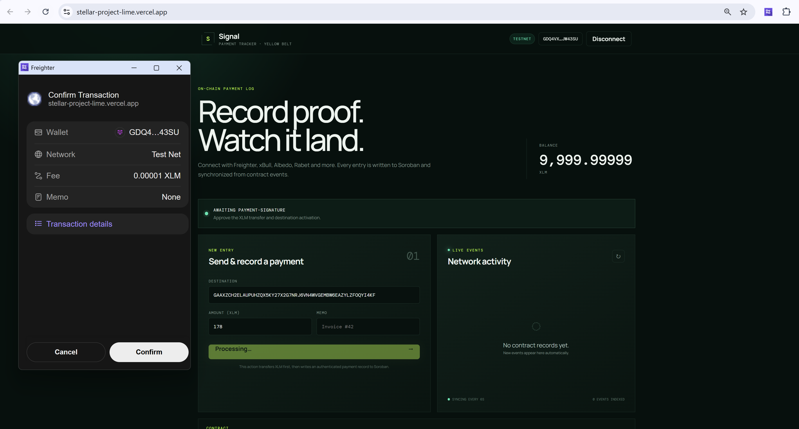
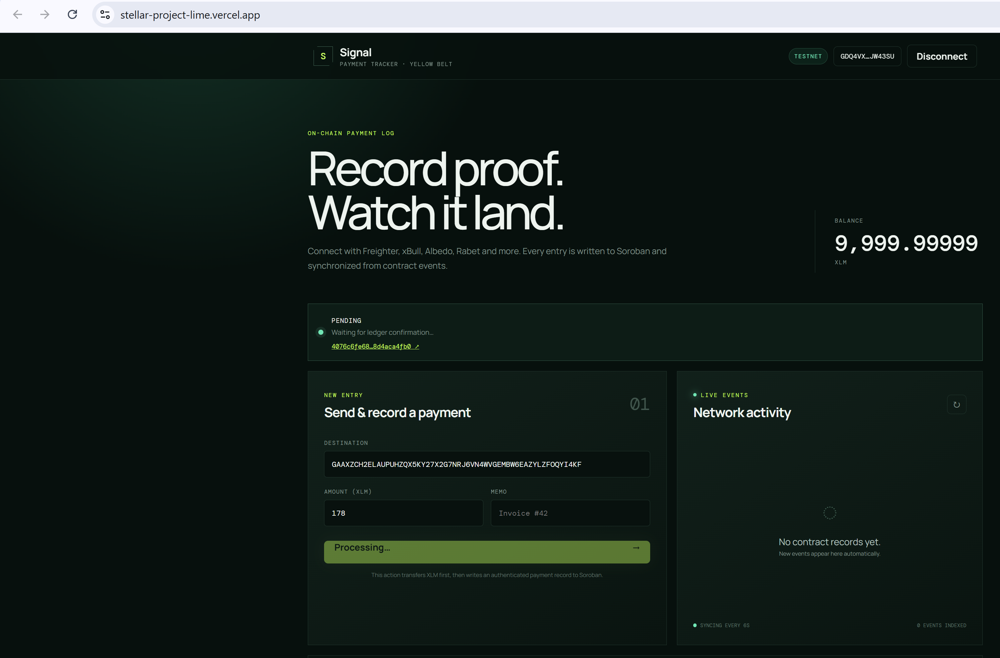

# TracePay — Yellow Belt Payment Tracker

TracePay is a multi-wallet Stellar Testnet dApp that transfers XLM and records
authenticated payment data through a deployed Soroban smart contract. New
contract events are synchronized with the live activity feed, which exposes
explicit loading, error, empty, and ready states plus a manual resync action.

**Live Demo:** https://stellar-project-lime.vercel.app

## Deployed Contract (Stellar Testnet)

| Field | Value |
| --- | --- |
| Network | Stellar Testnet |
| Contract ID | `CB6LYC7FWQTOWHPA3FZRYAOY7QSNUGIPQEN6U3BVCC3YKDDMYQGDHZ2J` |
| Explorer | [View contract on Stellar Expert](https://stellar.expert/explorer/testnet/contract/CB6LYC7FWQTOWHPA3FZRYAOY7QSNUGIPQEN6U3BVCC3YKDDMYQGDHZ2J) |
| Verified contract-call transaction | `b5fea73178ce5284ccd316c19ff5079fd76b60fcbe94f82eb7a631a95eb9b373` |
| Transaction explorer link | [View transaction on Stellar Expert](https://stellar.expert/explorer/testnet/tx/b5fea73178ce5284ccd316c19ff5079fd76b60fcbe94f82eb7a631a95eb9b373) |

The transaction above is a successful Soroban invocation of this exact
contract that emitted a `payment` event at ledger 4239593 (verifiable via the
[Stellar Expert](https://stellar.expert/explorer/testnet/tx/b5fea73178ce5284ccd316c19ff5079fd76b60fcbe94f82eb7a631a95eb9b373)
link or any Testnet explorer).

## Yellow Belt Features

- Multi-wallet integration using Stellar Wallets Kit
- Freighter, xBull, Albedo, Rabet and other compatible wallets
- Rust Soroban smart contract deployed on Testnet
- Smart contract calls from the frontend (read + write)
- Real-time contract event synchronization with explicit sync states
- Manual resynchronize control on the activity feed
- Visible pending, success and failure transaction states
- Actual XLM transfers between Stellar accounts
- Automatic activation of unfunded destination accounts
- Explorer links for every verified transaction

## Error Handling

Deliberately handled error classes (searchable in `src/lib/stellar.js`,
`src/lib/wallet.js`, and `src/App.jsx`):

1. **Insufficient balance** — blocked before signing with a readable message.
2. **Invalid destination address** — regex validation before any wallet call.
3. **User-rejected transactions** — signing rejections surface as actionable
   messages instead of raw errors.
4. Wrong network / unavailable wallet, RPC and on-chain failures, and
   confirmation timeouts each produce their own distinct message.

## Technology Stack

- React 19 · Vite
- Stellar Wallets Kit · Stellar SDK
- Rust · Soroban SDK
- Stellar Horizon + Soroban RPC
- Vercel

## Run Locally

```bash
npm install
copy .env.example .env.local
npm run dev
```

Set the deployed Testnet contract in `.env.local`:

```dotenv
VITE_CONTRACT_ID=CB6LYC7FWQTOWHPA3FZRYAOY7QSNUGIPQEN6U3BVCC3YKDDMYQGDHZ2J
```

## Smart Contract

The Rust/Soroban source lives in `contracts/payment-tracker`:

- `record(sender, destination, amount, memo)` — stores a payment record and
  emits a `payment` event (amount in stroops).
- `recent(limit)` — returns the most recent records for the activity feed.

## Screenshots

### Multi-wallet Options


### Wallet Connected on Testnet


### XLM Transfer Confirmation



### Smart Contract Call Confirmation


### Pending Transaction



### Success and Live Event


## Error Handling Evidence

### User-Rejected Transaction


### Insufficient Balance


### Invalid Destination Address


## Transaction Flow

1. Connect a supported Stellar wallet.
2. Enter a destination, XLM amount and optional memo.
3. Approve the XLM transfer.
4. Approve the Soroban contract record.
5. Follow the pending, success or failure status.
6. See the new record in the live activity feed (or press ↻ to resync).

All transactions and contract operations use Stellar Testnet only.
Never enter a real secret key anywhere in this application.
